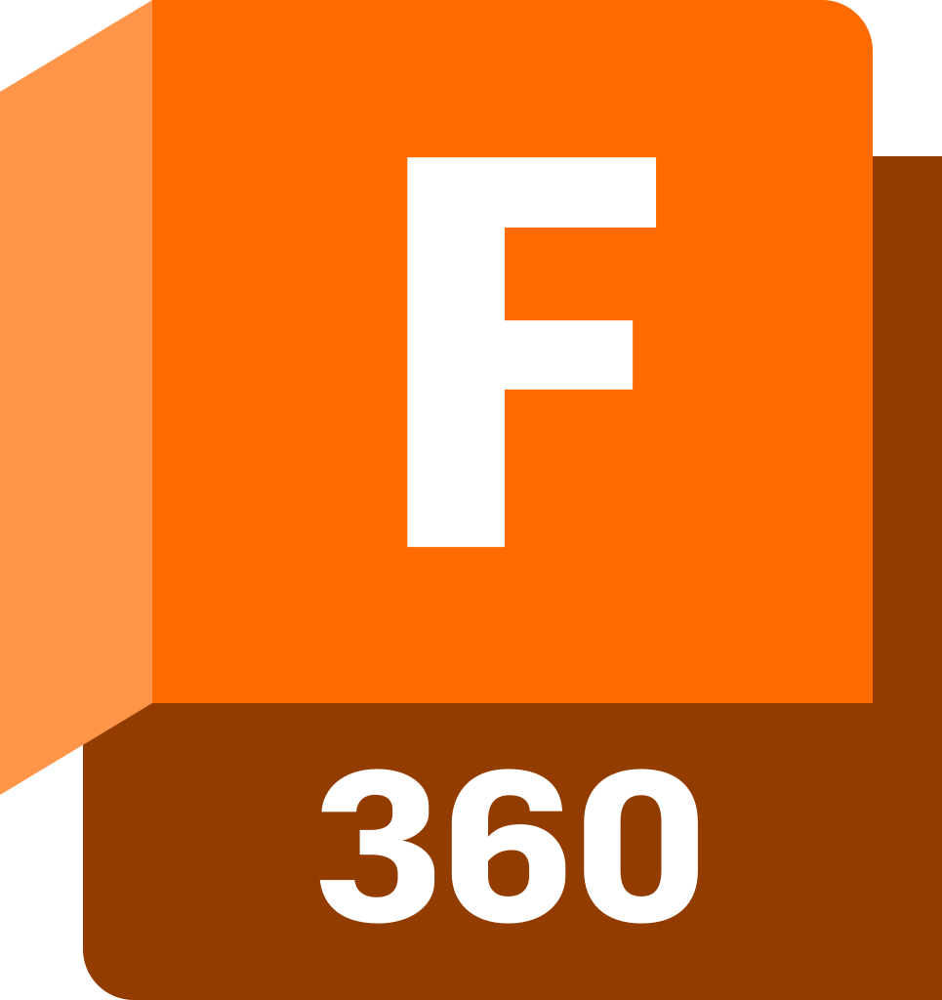
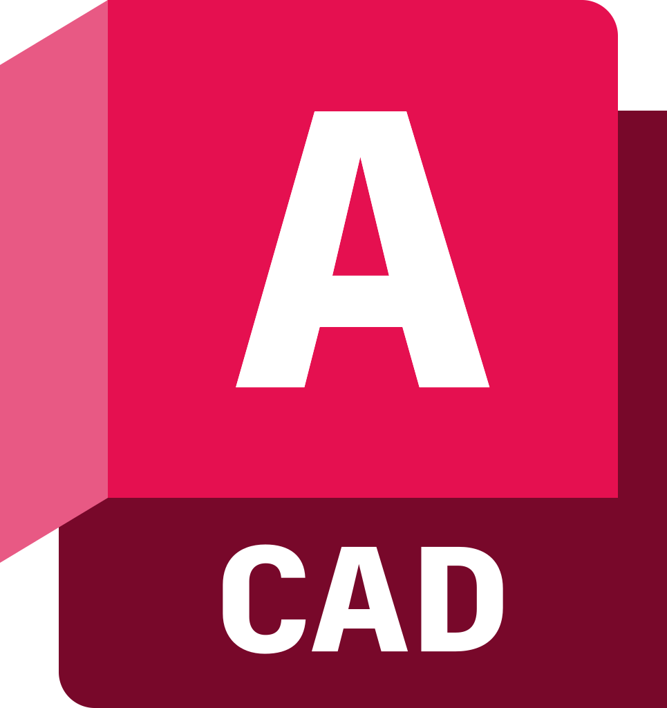
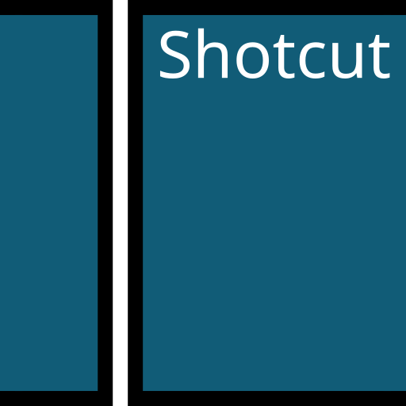

<h1 align="center">Hi 👋</h1>
<h3 align="center">Passionate thinkerer from Belgium</h3>

<h3 align="left">Connect with me:</h3>

    
    
    
    

<h3 align="left">Skills / Tools</h3>
<h2 align="left">Engineering</h2>

    
    
    
    
    
    

<h2 align="left">Programming</h2>

     
    
     
    
    
    
    

<h2 align="left">Extra</h2>

    
    
    

<h3 align="left">Support</h3>

    
    
    

  
